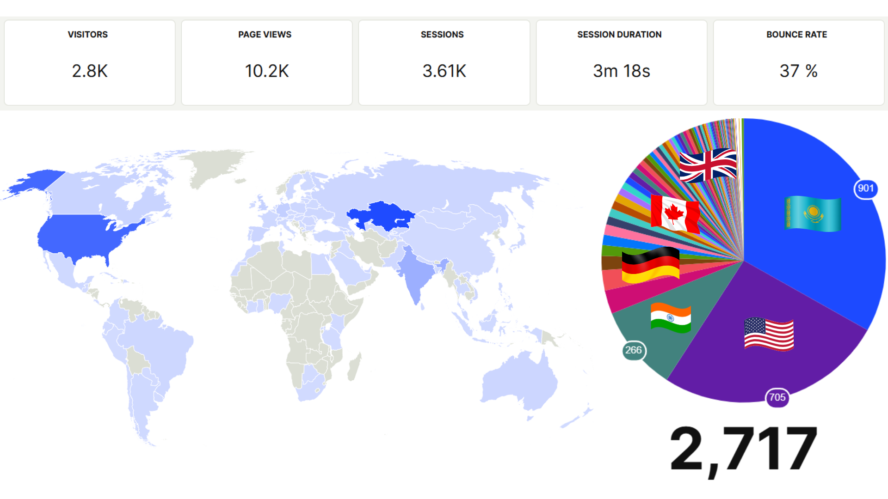

## What is Tarly AI?

 
<video
  muted
  autoPlay
  loop
  className="w-full aspect-video"
  poster="./assets/tarlyai/og.png"
>
  <source src="https://www.loom.com/share/8fc65583e799474581cc67c10948ec5b?sid=14484bdd-37f5-4c8d-8690-c23069f928b4" />
</video>

## Introduction

Tarly is the personal brand infrastructure for modern professionals. Pro-grade CVs, LaTeX formatting, Personal websites, and Career roadmaps, all in one. Loved by early adopters from Higgsfield AI, Surfaice AI, Google STEP and more...

## A story behind it

I’m a developer myself, and I know that feeling when your resume/CV gets ghosted. "Thanks" to all those ATS optimizations, relevence scores, and impact metrics. When I created my first CV, I spent a ton of time searching for templates, struggling with LaTeX syntax. I'd just copied it and paste it into ChatGPT to change something, then again copied updated version, pasted in Overleaf, recompiled it... over and over again..

Plus, most digital professionals are "required" to have Personal Website to showcase experience, projects, and thoughts. You can generate one in 1 min at tarly.works/your-name

## Features

◆ Create a pro-grade, ATS-friendly CV.
◆ Edit your Resume via LLM prompts (like in Cursor).
◆ Generate a tailored career roadmap based on your PDF resume.
◆ Package everything into a shareable Personal website (tarly.works/your-name)

## Web Analytics

 

  

## Show Some Support

Love Tarly AI? Support us on Product Hunt!

{' '}

